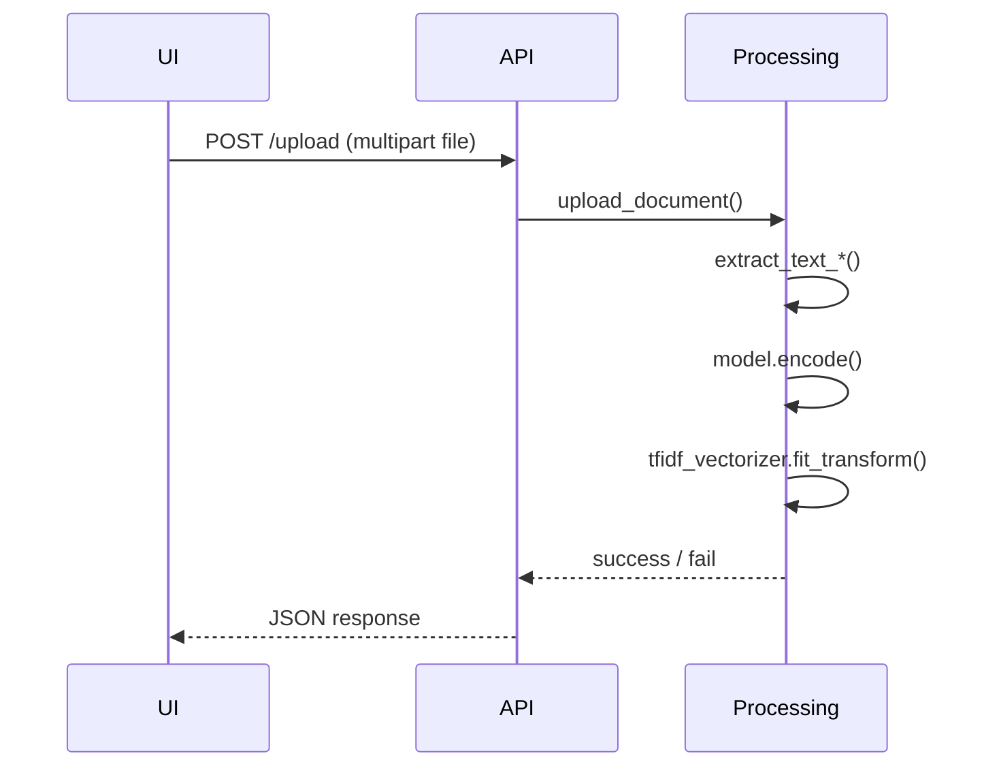
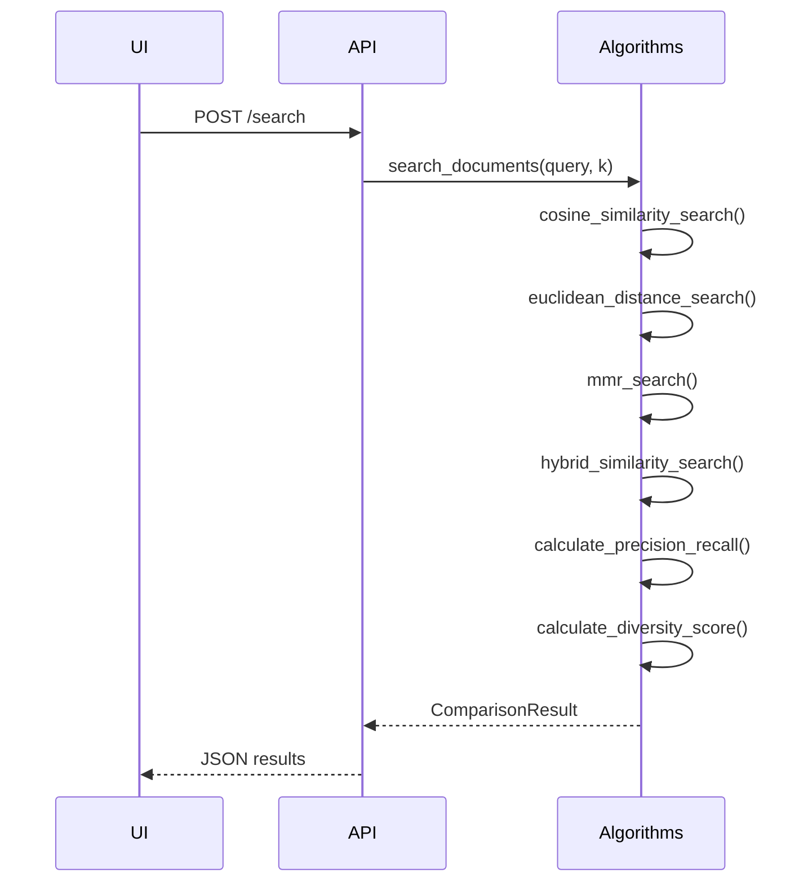
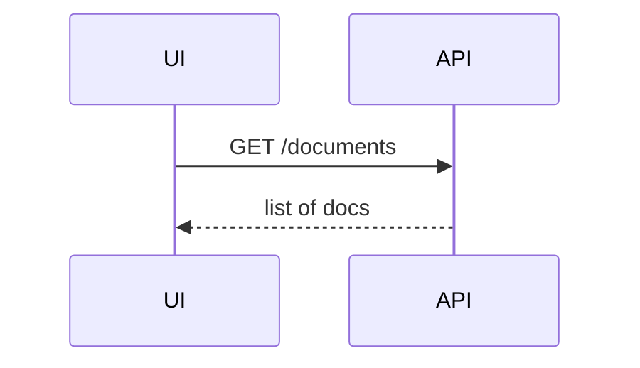
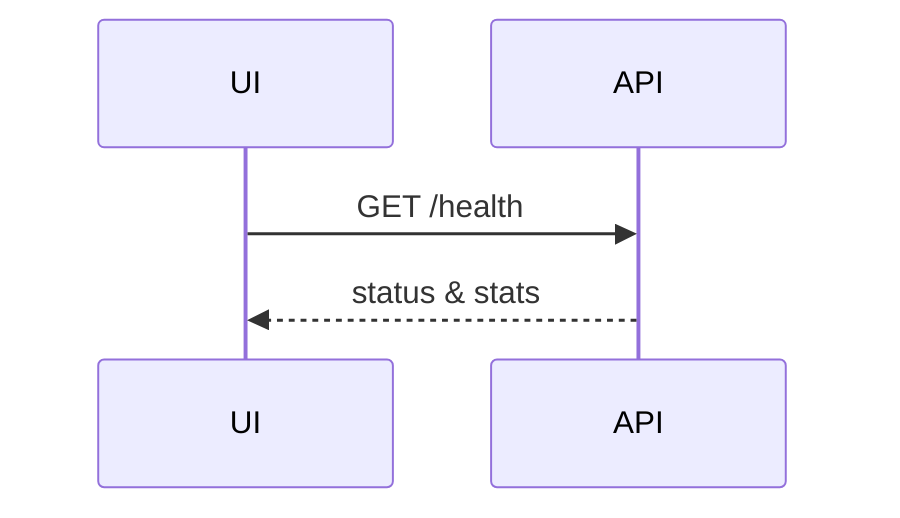

# 📜 Indian Legal Document Search – Runtime Flow

This document explains **what happens under the hood** when each public endpoint is hit.  For every flow you will find:

* A plain-text arrow diagram (`A -> B -> C`)  
* The same flow rendered as a Mermaid sequence diagram.

> *Actors used below*  
> **UI** – Streamlit front-end (`app.py`)  
> **API** – FastAPI back-end (`main.py`)

---

## 1️⃣  `POST /upload`

### Arrow view

```
UI (file uploader)
  -> API  /upload
        -> upload_document(file)
              -> extract_text_from_pdf / extract_text_from_docx / raw-txt
              -> SentenceTransformer.encode()
              -> rebuild TF-IDF matrix (TfidfVectorizer.fit_transform)
              -> update in-memory `documents`, `document_embeddings`, `tfidf_matrix`
  <- JSON  {"message": "Document … uploaded successfully"}
```

### Mermaid view



---

## 2️⃣  `POST /search`

### Arrow view

```
UI (search box)
  -> API /search {query, top_k}
        -> search_documents()
              -> cosine_similarity_search()
              -> euclidean_distance_search()
              -> mmr_search()
              -> hybrid_similarity_search()
              -> calculate_* metrics (precision, recall, F1, diversity)
        <- aggregated ComparisonResult
  <- JSON with results & metrics
```

*Internal helper calls*

* `SentenceTransformer.encode()` – vectorises query & docs
* `cosine_similarity`, `euclidean_distances` – sklearn pairwise metrics
* `extract_legal_entities()` & `calculate_legal_entity_similarity()` – for hybrid method

### Mermaid view



---

## 3️⃣  `GET /documents`

### Arrow view

```
UI (Documents table)
  -> API /documents
        -> get_documents()
  <- JSON {documents: [...]} 
```

### Mermaid



---

## 4️⃣  `GET /health`

### Arrow view

```
UI (sidebar health)
  -> API /health
        -> health_check()
  <- JSON {status: "healthy", total_documents: N}
```

### Mermaid



---

### Notes

* All data is **in-memory**; no external database is used.
* The Sentence-Transformer model (`all-MiniLM-L6-v2`) is loaded once during `startup`.
* CORS is fully open (`allow_origins=["*"]`) to allow the Streamlit front-end to call the API.
* When you **add your own documents**, embeddings and TF-IDF matrices are re-computed for the whole corpus.  For large data sets you may want to persist vectors or use an index like FAISS.
